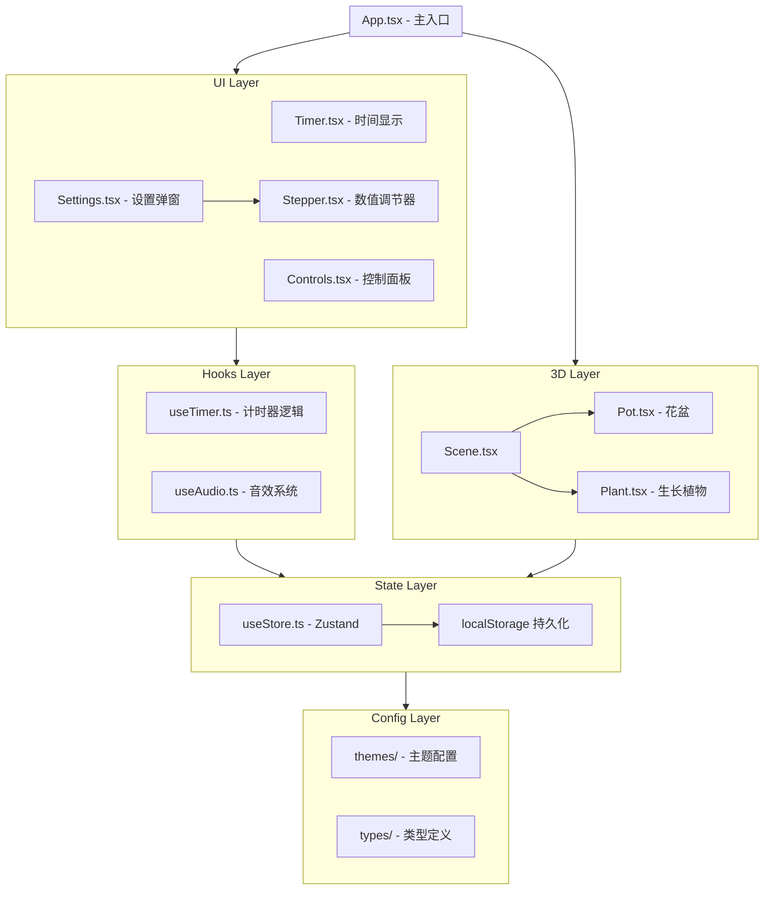

# Zen-Station - 动态番茄钟工作站

> 扫描时间: 2026-02-05 11:23:31 | 状态: MVP 开发中

## 项目愿景

禅意风格的 3D 番茄钟 PWA 应用。用户专注工作时，屏幕中央的 3D 盆栽随时间缓慢生长，完成的番茄钟累积到植物总生长值，形成长期养成体验。

## 技术栈

| 层级 | 技术 | 版本 |
|------|------|------|
| 框架 | React + TypeScript | 19.2.0 |
| 构建 | Vite | 7.2.4 |
| 3D 渲染 | Three.js + React Three Fiber + drei | 0.182.0 / 9.5.0 / 10.7.7 |
| 样式 | Tailwind CSS | 4.1.18 |
| 状态管理 | Zustand | 5.0.11 |
| 音频 | Howler.js | 2.2.4 |
| PWA | vite-plugin-pwa | 1.2.0 |
| 代码质量 | ESLint + TypeScript ESLint | 9.39.1 |

## 架构总览



## 目录结构

```
zen-station/
├── src/
│   ├── App.tsx              # 主应用入口
│   ├── main.tsx             # React 挂载点
│   ├── index.css            # 全局样式 + CSS 变量
│   ├── components/          # UI 组件
│   │   ├── Timer.tsx        # 时间显示
│   │   ├── Controls.tsx     # 开始/暂停/设置按钮
│   │   ├── Settings.tsx     # 设置弹窗
│   │   └── Stepper.tsx      # 数值调节组件
│   ├── three/               # 3D 场景
│   │   ├── Scene.tsx        # Canvas 容器
│   │   ├── Plant.tsx        # 生长植物（4 阶段）
│   │   ├── Pot.tsx          # 陶土花盆
│   │   └── index.ts         # 导出
│   ├── hooks/               # 自定义 hooks
│   │   ├── useTimer.ts      # 计时器逻辑
│   │   ├── useAudio.ts      # Howler.js 音效
│   │   └── index.ts         # 导出
│   ├── stores/              # 状态管理
│   │   └── useStore.ts      # Zustand + persist
│   ├── themes/              # 主题配置
│   │   ├── zen-garden.ts    # 禅意花园主题
│   │   └── index.ts         # 导出
│   ├── types/               # TypeScript 类型
│   │   └── index.ts         # 全部类型定义
│   └── assets/              # 静态资源
├── public/
│   ├── sounds/              # 音效文件（待添加）
│   └── icons/               # PWA 图标（待添加）
├── docs/plans/              # 设计文档
├── vite.config.ts           # Vite + PWA 配置
├── eslint.config.js         # ESLint 配置
├── tsconfig.json            # TypeScript 配置
└── package.json             # 依赖配置
```

## 核心模块详解

### 状态管理 (stores/useStore.ts)

使用 Zustand + persist 中间件，持久化到 localStorage。

**状态结构：**
```typescript
interface StoreState {
  timer: TimerState;        // 计时器状态
  settings: TimerSettings;  // 时长设置
  stats: Stats;             // 统计数据
  plant: PlantState;        // 植物生长状态
  themeId: string;          // 当前主题
  volume: number;           // 音量 0-1
  isMuted: boolean;         // 静音
  isSettingsOpen: boolean;  // 设置弹窗
}
```

**主要 Actions：**
- `startTimer()` / `pauseTimer()` / `resetTimer()` - 计时器控制
- `tick()` - 每秒调用，更新时间和植物进度
- `completePomodoro()` - 完成番茄钟，更新统计和植物
- `updateSettings()` - 更新设置

### 计时器 Hook (hooks/useTimer.ts)

封装计时器逻辑，管理 setInterval。

**返回值：**
```typescript
{
  status: TimerStatus;      // 'idle' | 'running' | 'paused'
  timeRemaining: number;    // 剩余秒数
  formattedTime: string;    // "25:00" 格式
  currentSession: number;   // 当前轮次
  isWorkSession: boolean;   // 工作/休息
  toggle: () => void;       // 开始/暂停
  reset: () => void;        // 重置
}
```

### 3D 植物 (three/Plant.tsx)

基于累积番茄钟数的 4 阶段生长系统：

| 阶段 | 番茄钟数 | 视觉效果 |
|------|----------|----------|
| sprout | 0-3 | 小植物 |
| young | 4-11 | 开始分枝 |
| mature | 12-23 | 枝叶丰满 |
| ancient | 24+ | 完整盆栽 |

**动画特性：**
- 计时运行时轻微摇摆
- 进度同步的脉冲发光效果
- 平滑的缩放过渡 (MathUtils.lerp)

### 主题系统 (themes/)

当前实现：禅意花园主题

```typescript
{
  id: 'zen-garden',
  colors: {
    background: ['#FAF8F5', '#F0EBE3'], // 渐变
    primary: '#2D4A3E',    // 墨绿
    accent: '#C9B99A',     // 枯山水砂色
    text: '#333333',
  },
  lighting: 'soft',
  sounds: 'bowl',
}
```

## 数据模型

### TimerSettings
```typescript
{
  workDuration: 25 * 60,     // 默认 25 分钟
  shortBreak: 5 * 60,        // 默认 5 分钟
  longBreak: 15 * 60,        // 默认 15 分钟
  longBreakInterval: 4,      // 每 4 轮长休息
}
```

### Stats (统计)
```typescript
{
  totalPomodoros: number;    // 总完成数
  todayPomodoros: number;    // 今日完成数
  streakDays: number;        // 连续天数
  lastActiveDate: string;    // YYYY-MM-DD
}
```

### PlantState
```typescript
{
  type: 'bonsai';            // 植物类型
  totalGrowth: number;       // 累积番茄钟
  currentProgress: number;   // 当前进度 0-1
}
```

## 快速命令

```bash
# 开发环境
npm run dev

# 生产构建
npm run build

# 预览构建
npm run preview

# 代码检查
npm run lint
```

## PWA 配置

已配置 vite-plugin-pwa：
- 自动更新 Service Worker
- 离线缓存策略 (Workbox)
- Google Fonts 缓存
- 支持 standalone 模式

**待完成：**
- [ ] 添加 PWA 图标 (192x192, 512x512)
- [ ] 添加音效文件 (bowl-start.mp3, bowl-complete.mp3, tick.mp3)

## 设计规范

### 颜色
- 主色：`#2D4A3E` (墨绿)
- 强调色：`#C9B99A` (砂色)
- 背景：`#FAF8F5` -> `#F0EBE3` (渐变)
- 文字：`#333333` / `#666666`

### 字体
- 计时器：Roboto Mono (等宽)
- UI：Inter (无衬线)

### 布局比例
- 3D 场景：60%
- 时间显示：15%
- 控制面板：25%

## AI 使用指引

1. **项目类型**：番茄钟 + 3D 可视化 PWA
2. **设计原则**：极简美学、沉浸体验、响应式移动优先
3. **扩展方向**：
   - 主题系统（可切换多种风格）
   - 植物系统（可切换多种植物）
   - 统计可视化
   - 系统通知
4. **代码风格**：
   - 使用 TypeScript 严格模式
   - 组件使用函数式 + hooks
   - 状态使用 Zustand
   - 样式使用 Tailwind + CSS 变量

## 设计文档

- [设计文档](docs/plans/2026-02-04-zen-station-design.md) - 详细功能设计
- [实施计划](docs/plans/2026-02-04-zen-station-implementation.md) - 分阶段实施步骤

## 变更记录

| 日期 | 变更内容 |
|------|---------|
| 2026-02-05 | 更新文档：MVP 核心功能已实现，补充详细模块说明和数据模型 |
| 2026-02-04 | 完成设计文档，项目初始化 |
