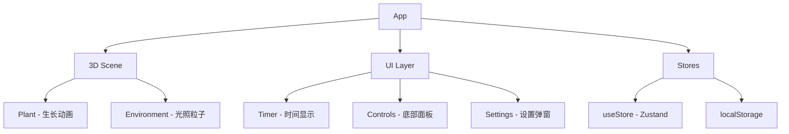

# Zen-Station - 动态番茄钟工作站

> 扫描时间: 2026-02-04 | 状态: 设计完成，待初始化

## 项目愿景

禅意风格的 3D 番茄钟 PWA 应用。用户专注工作时，屏幕中央的 3D 盆栽随时间缓慢生长，完成的番茄钟累积到植物总生长值，形成长期养成体验。

## 技术栈

```
React 18 + TypeScript + Vite
Three.js + React Three Fiber + @react-three/drei
Tailwind CSS 4 + CSS 变量
Zustand + localStorage
vite-plugin-pwa
```

## 架构总览



## 目录结构

```
src/
├── components/      # UI 组件
├── three/           # 3D 场景
├── hooks/           # 自定义 hooks
├── stores/          # 状态管理
├── themes/          # 主题配置
├── plants/          # 植物配置
├── types/           # 类型定义
└── App.tsx
```

## 核心模块

| 模块 | 文件 | 职责 |
|------|------|------|
| 计时器 | `hooks/useTimer.ts` | 番茄钟倒计时逻辑 |
| 植物 | `three/Plant.tsx` | 3D 生长动画 |
| 状态 | `stores/useStore.ts` | 全局状态 + 持久化 |
| 主题 | `themes/zen-garden.ts` | 禅意花园配色 |

## 设计文档

详细设计见 [docs/plans/2026-02-04-zen-station-design.md](docs/plans/2026-02-04-zen-station-design.md)

## 快速命令

```bash
# 开发
npm run dev

# 构建
npm run build

# 预览
npm run preview
```

## AI 使用指引

- **番茄钟 + 3D 可视化**项目
- 强调**极简美学**和**沉浸体验**
- **响应式设计**，移动端优先
- 可扩展架构：主题切换、植物切换

## 变更记录

| 日期 | 变更内容 |
|------|---------|
| 2026-02-04 | 完成设计文档，待项目初始化 |
